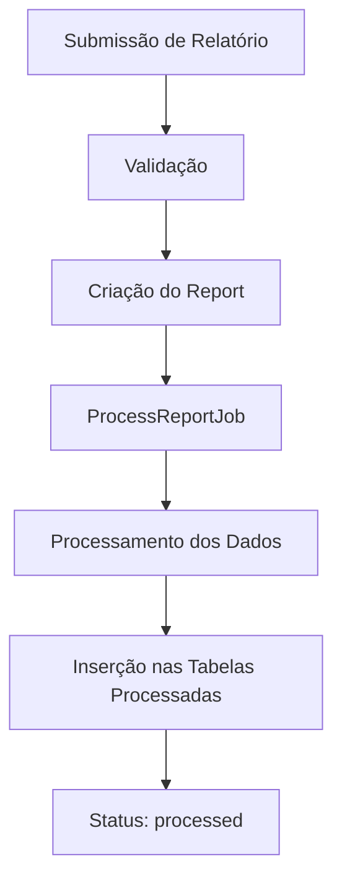
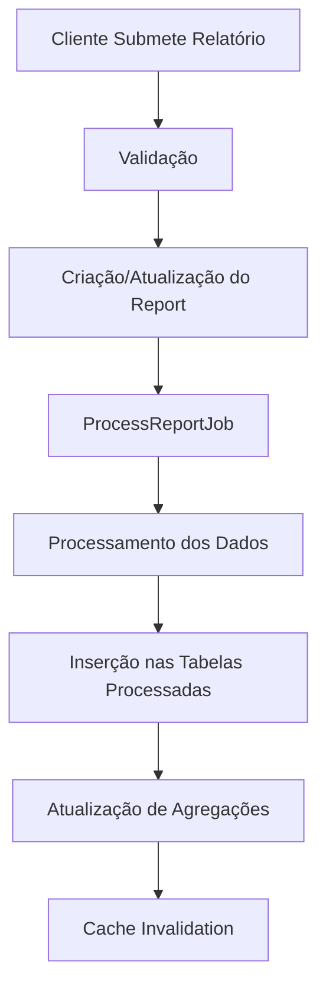
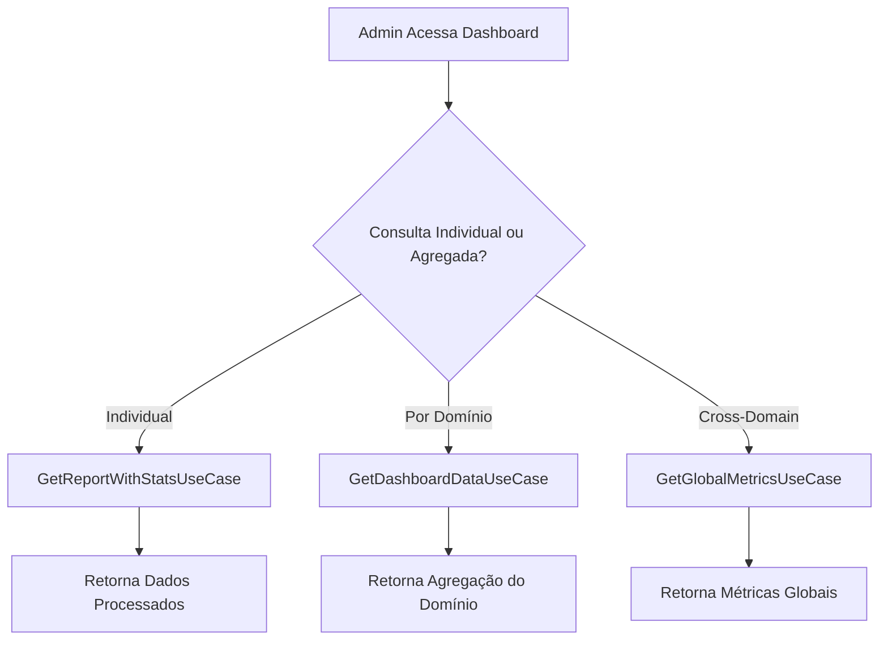

# 📊 Sistema de Relatórios - Design Completo e Objetivo Final

## 🎯 **Objetivo Final**

O sistema foi projetado para atender dois cenários principais:

### **1. Relatórios por Domínio Específico** 🏢
- **Filtro por data**: Relatórios de um domínio específico em períodos determinados
- **Agregação temporal**: Merge de todos os relatórios de um domínio ao longo do tempo
- **Dashboard individual**: Visão completa de um domínio específico

### **2. Relatórios Cross-Domain (Global)** 🌐
- **Agregação de todos os domínios**: Ranking de domínios por volume de consultas
- **Análise de tecnologias**: Distribuição de tecnologias entre todos os domínios
- **Métricas globais**: Estatísticas consolidadas de toda a plataforma

---

## 🏗️ **Arquitetura Atual**

### **1. Estrutura de Dados**

#### **Entidades Principais**
```php
Domain (domínios)
├── id, name, api_key, status
├── Relacionamento: hasMany(Report)

Report (relatórios individuais)
├── id, domain_id, report_date, status
├── raw_data (JSON com dados originais)
├── Relacionamentos: belongsTo(Domain), hasMany(ReportSummary, ReportProvider, etc.)

ReportSummary (resumo processado)
├── report_id, total_requests, success_rate, avg_speed
├── Relacionamento: belongsTo(Report)

ReportProvider (provedores por relatório)
├── report_id, provider_id, technology, total_count, success_rate
├── Relacionamento: belongsTo(Report), belongsTo(Provider)

ReportState/City/ZipCode (dados geográficos por relatório)
├── report_id, state_id/city_id/zipcode_id, request_count
├── Relacionamento: belongsTo(Report), belongsTo(State/City/ZipCode)
```

#### **Fluxo de Processamento**


---

## 🔧 **Funcionalidades Implementadas**

### **1. Submissão de Relatórios** ✅

#### **Endpoint Principal**
```http
POST /api/reports/submit
Headers: X-API-KEY: {domain_api_key}
```

#### **Endpoint Diário (WordPress)**
```http
POST /api/reports/submit-daily
Headers: X-API-KEY: {domain_api_key}
```

**Características:**
- ✅ Autenticação por API Key
- ✅ Validação de dados
- ✅ Upsert logic (atualiza relatórios existentes para mesma data)
- ✅ Processamento assíncrono via Jobs
- ✅ Suporte a múltiplos formatos (original + WordPress)

### **2. Visualização Individual** ✅

#### **Relatório Específico**
```http
GET /api/admin/reports/{id}
Headers: Authorization: Bearer {admin_token}
```

**Retorna:**
- ✅ Dados processados estruturados
- ✅ Summary, providers, geographic data
- ✅ Raw data original

### **3. Agregação por Domínio** ✅

#### **Dashboard do Domínio**
```http
GET /api/admin/reports/domain/{domain_id}/dashboard
Headers: Authorization: Bearer {admin_token}
```

**Retorna:**
- ✅ KPIs agregados (total_requests, success_rate, etc.)
- ✅ Distribuição de provedores
- ✅ Top estados/cidades/CEPs
- ✅ Distribuição por horário
- ✅ Velocidade média por estado
- ✅ Distribuição de tecnologias
- ✅ Taxa de exclusão por provedor

#### **Agregação Estatística**
```http
GET /api/admin/reports/domain/{domain_id}/aggregate
Headers: Authorization: Bearer {admin_token}
```

**Retorna:**
- ✅ Merge de todos os relatórios do domínio
- ✅ Summary agregado (soma total_requests, média success_rate)
- ✅ Top providers agregados
- ✅ Top estados/cidades/CEPs agregados
- ✅ Trends diários (evolução ao longo do tempo)

---

## 🚧 **Funcionalidades Pendentes (Objetivo Final)**

### **1. Relatórios Cross-Domain** ❌

#### **Ranking de Domínios**
```http
GET /api/admin/reports/global/domain-ranking
Headers: Authorization: Bearer {admin_token}
```

**Deve retornar:**
- ❌ Ranking de domínios por volume de consultas
- ❌ Top domínios por período
- ❌ Comparação entre domínios

#### **Análise Global de Tecnologias**
```http
GET /api/admin/reports/global/technology-analysis
Headers: Authorization: Bearer {admin_token}
```

**Deve retornar:**
- ❌ Distribuição de tecnologias entre todos os domínios
- ❌ Top tecnologias por volume
- ❌ Evolução das tecnologias ao longo do tempo

#### **Métricas Globais**
```http
GET /api/admin/reports/global/metrics
Headers: Authorization: Bearer {admin_token}
```

**Deve retornar:**
- ❌ Total de consultas de todos os domínios
- ❌ Taxa de sucesso global
- ❌ Distribuição geográfica global
- ❌ Top provedores globais

### **2. Filtros Avançados** ❌

#### **Filtro por Período**
```http
GET /api/admin/reports/domain/{domain_id}/aggregate?date_from=2025-01-01&date_to=2025-01-31
```

#### **Filtro por Status**
```http
GET /api/admin/reports?status=processed&domain_id=1
```

#### **Filtro por Tecnologia**
```http
GET /api/admin/reports/global/technology-analysis?technology=Fiber
```

---

## 📊 **Estrutura de Dados para Cross-Domain**

### **1. Tabelas de Agregação Global**

#### **Domain Rankings**
```sql
CREATE TABLE domain_rankings (
    id BIGSERIAL PRIMARY KEY,
    domain_id BIGINT REFERENCES domains(id),
    period_start DATE NOT NULL,
    period_end DATE NOT NULL,
    total_requests BIGINT,
    success_rate DECIMAL(5,2),
    unique_providers INTEGER,
    rank_position INTEGER,
    created_at TIMESTAMP DEFAULT NOW(),
    
    UNIQUE(domain_id, period_start, period_end)
);
```

#### **Global Technology Stats**
```sql
CREATE TABLE global_technology_stats (
    id BIGSERIAL PRIMARY KEY,
    technology VARCHAR(50) NOT NULL,
    period_start DATE NOT NULL,
    period_end DATE NOT NULL,
    total_requests BIGINT,
    domain_count INTEGER,
    avg_success_rate DECIMAL(5,2),
    created_at TIMESTAMP DEFAULT NOW(),
    
    UNIQUE(technology, period_start, period_end)
);
```

### **2. Use Cases Necessários**

#### **GetGlobalDomainRankingUseCase**
```php
class GetGlobalDomainRankingUseCase
{
    public function execute(?string $dateFrom = null, ?string $dateTo = null): array
    {
        // Agregar todos os domínios por período
        // Calcular ranking por volume de consultas
        // Retornar top domínios
    }
}
```

#### **GetGlobalTechnologyAnalysisUseCase**
```php
class GetGlobalTechnologyAnalysisUseCase
{
    public function execute(?string $technology = null): array
    {
        // Analisar distribuição de tecnologias
        // Calcular métricas por tecnologia
        // Retornar análise global
    }
}
```

#### **GetGlobalMetricsUseCase**
```php
class GetGlobalMetricsUseCase
{
    public function execute(): array
    {
        // Calcular métricas globais
        // Total de consultas, taxa de sucesso
        // Distribuição geográfica global
    }
}
```

---

## 🔄 **Fluxo de Dados Completo**

### **1. Submissão e Processamento**


### **2. Visualização**


---

## 🎯 **Roadmap de Implementação**

### **Fase 1: Cross-Domain Básico** 🚧
1. **Criar tabelas de agregação global**
   - `domain_rankings`
   - `global_technology_stats`
   - `global_metrics`

2. **Implementar Use Cases**
   - `GetGlobalDomainRankingUseCase`
   - `GetGlobalTechnologyAnalysisUseCase`
   - `GetGlobalMetricsUseCase`

3. **Criar endpoints**
   - `/api/admin/reports/global/domain-ranking`
   - `/api/admin/reports/global/technology-analysis`
   - `/api/admin/reports/global/metrics`

### **Fase 2: Filtros Avançados** 🚧
1. **Implementar filtros por período**
2. **Implementar filtros por tecnologia**
3. **Implementar filtros por status**

### **Fase 3: Otimizações** 🚧
1. **Cache de agregações**
2. **Jobs de pré-cálculo**
3. **Índices de performance**

---

## 📈 **Exemplos de Uso**

### **1. Dashboard Individual (Atual)**
```bash
# Dashboard do domínio zip.50g.io
curl -s "http://localhost:8006/api/admin/reports/domain/1/dashboard" \
  -H "Authorization: Bearer $TOKEN" | jq '.data.kpis'
```

**Resposta:**
```json
{
  "kpis": {
    "total_requests": 1502,
    "success_rate": 85.15,
    "avg_speed": 1502.89,
    "unique_providers": 84,
    "unique_states": 20
  }
}
```

### **2. Ranking Global (Futuro)**
```bash
# Ranking de todos os domínios
curl -s "http://localhost:8006/api/admin/reports/global/domain-ranking" \
  -H "Authorization: Bearer $TOKEN" | jq '.data.ranking'
```

**Resposta esperada:**
```json
{
  "ranking": [
    {
      "domain": {
        "id": 1,
        "name": "zip.50g.io"
      },
      "total_requests": 1502,
      "success_rate": 85.15,
      "rank": 1
    },
    {
      "domain": {
        "id": 2,
        "name": "outro-dominio.com"
      },
      "total_requests": 1200,
      "success_rate": 78.5,
      "rank": 2
    }
  ]
}
```

### **3. Análise de Tecnologias (Futuro)**
```bash
# Análise global de tecnologias
curl -s "http://localhost:8006/api/admin/reports/global/technology-analysis" \
  -H "Authorization: Bearer $TOKEN" | jq '.data.technologies'
```

**Resposta esperada:**
```json
{
  "technologies": [
    {
      "technology": "Mobile",
      "total_requests": 5000,
      "domain_count": 3,
      "avg_success_rate": 82.5
    },
    {
      "technology": "Fiber",
      "total_requests": 3000,
      "domain_count": 2,
      "avg_success_rate": 95.2
    }
  ]
}
```

---

## 🔍 **Status Atual vs Objetivo Final**

| Funcionalidade | Status Atual | Objetivo Final | Implementado |
|----------------|--------------|----------------|--------------|
| **Submissão de Relatórios** | ✅ | ✅ | ✅ |
| **Relatório Individual** | ✅ | ✅ | ✅ |
| **Dashboard por Domínio** | ✅ | ✅ | ✅ |
| **Agregação por Domínio** | ✅ | ✅ | ✅ |
| **Ranking de Domínios** | ❌ | ✅ | ❌ |
| **Análise Global de Tecnologias** | ❌ | ✅ | ❌ |
| **Métricas Globais** | ❌ | ✅ | ❌ |
| **Filtros por Período** | ❌ | ✅ | ❌ |
| **Filtros por Tecnologia** | ❌ | ✅ | ❌ |

---

## 🎉 **Conclusão**

O sistema atual já implementa **60% do objetivo final**, com todas as funcionalidades básicas de relatórios por domínio funcionando perfeitamente. 

**Próximos passos:**
1. Implementar funcionalidades cross-domain
2. Adicionar filtros avançados
3. Otimizar performance com cache e agregações

O design atual é sólido e permite fácil extensão para as funcionalidades pendentes, mantendo a arquitetura limpa e escalável.

---

## 📚 **Documentação Relacionada**

- [API Guide](./REPORTS_API_GUIDE.md) - Guia completo da API atual
- [Dashboard Guide](./DASHBOARD_COMPLETO.md) - Documentação do dashboard
- [Daily Reports Guide](./ENDPOINT_DIARIOS_COMPLETO.md) - Relatórios diários
- [System Design](./ISP_REPORTING_SYSTEM.md) - Design técnico detalhado
